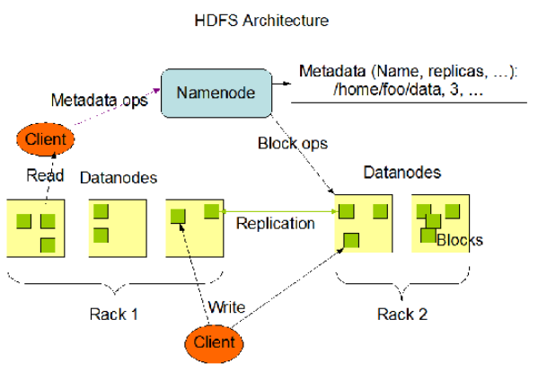
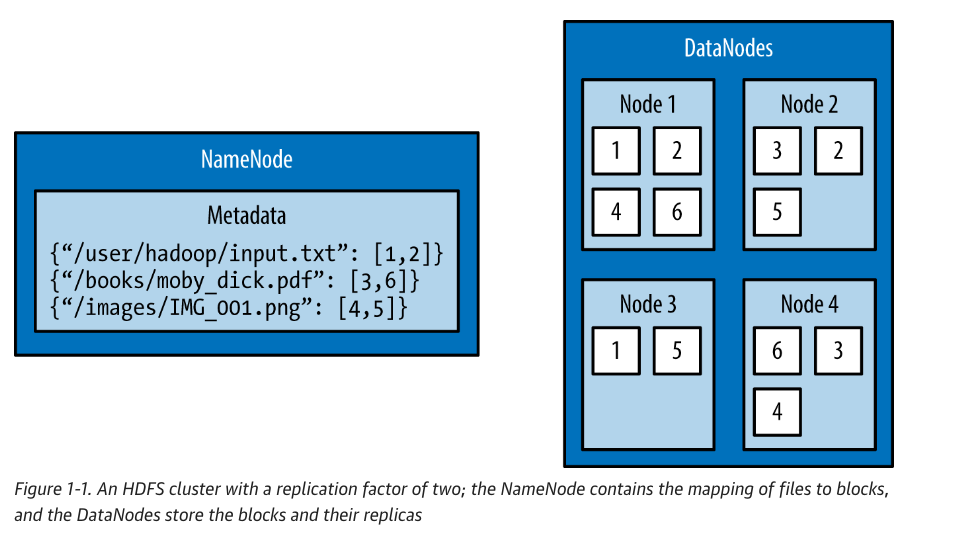

# Apache Hadoop
- URL :  <i>https://hadoop.apache.org/,  https://www.oreilly.com/content/hadoop-with-python/</i>

The Apache Hadoop software library is a framework that allows for the distributed processing of large data sets across clusters of computers using simple programming models. It is designed to scale up from single servers to thousands of machines, each offering local computation and storage <i>

Basic architecture of Apache Hadoop



The architectural design of HDFS is composed of two processes: 
- a process known as the NameNode holds the metadata for the filesystem : `The NameNode` is the most important machine in HDFS. It stores metadata for the entire filesystem: filenames, file permissions, and the location of each block of each file. To allow fast access to this information, the NameNode stores the entire metadata structure in memory. The NameNode also tracks the replication factor of blocks, ensuring that machine failures do not result in data loss.
- one or more DataNode processes store the blocks that make up the files : The machines that store the blocks within HDFS are referred to as DataNodes. `DataNodes` are typically commodity machines with large storage capacities. Unlike the NameNode, HDFS will continue to operate normally if a DataNode fails. When a DataNode fails, the NameNode will replicate the lost blocks to ensure each block meets the minimum replication factor.

The following section describes how to interact with HDFS using the built-in commands.



Interacting with HDFS
Interacting with HDFS is primarily performed from the command line using the script named hdfs. The hdfs script has the following usage:

```bash
$ hdfs COMMAND [-option <arg>]
```

Create a basic docker-compose.yaml file like:

```bash

docker-compose up -d

docker-3 % docker-compose up -d    
Creating network "docker-3_default" with the default driver
Creating docker-3_namenode_1        ... done
Creating docker-3_datanode_1        ... done
Creating docker-3_nodemanager_1     ... done
Creating docker-3_resourcemanager_1 ... done

# Can login into any node by specifying the container like:
docker exec -it docker-3_namenode_1 /bin/bash

# --
version: "2"
services:
   namenode:
      image: apache/hadoop:3
      hostname: namenode
      command: ["hdfs", "namenode"]
      ports:
        - 9870:9870
      env_file:
        - ./config
      environment:
          ENSURE_NAMENODE_DIR: "/tmp/hadoop-root/dfs/name"
   datanode:
      image: apache/hadoop:3
      command: ["hdfs", "datanode"]
      env_file:
        - ./config      
   resourcemanager:
      image: apache/hadoop:3
      hostname: resourcemanager
      command: ["yarn", "resourcemanager"]
      ports:
         - 8088:8088
      env_file:
        - ./config
      volumes:
        - ./test.sh:/opt/test.sh
   nodemanager:
      image: apache/hadoop:3
      command: ["yarn", "nodemanager"]
      env_file:
        - ./config
        
Create a config file like:

CORE-SITE.XML_fs.default.name=hdfs://namenode
CORE-SITE.XML_fs.defaultFS=hdfs://namenode
HDFS-SITE.XML_dfs.namenode.rpc-address=namenode:8020
HDFS-SITE.XML_dfs.replication=1
MAPRED-SITE.XML_mapreduce.framework.name=yarn
MAPRED-SITE.XML_yarn.app.mapreduce.am.env=HADOOP_MAPRED_HOME=$HADOOP_HOME
MAPRED-SITE.XML_mapreduce.map.env=HADOOP_MAPRED_HOME=$HADOOP_HOME
MAPRED-SITE.XML_mapreduce.reduce.env=HADOOP_MAPRED_HOME=$HADOOP_HOME
YARN-SITE.XML_yarn.resourcemanager.hostname=resourcemanager
YARN-SITE.XML_yarn.nodemanager.pmem-check-enabled=false
YARN-SITE.XML_yarn.nodemanager.delete.debug-delay-sec=600
YARN-SITE.XML_yarn.nodemanager.vmem-check-enabled=false
YARN-SITE.XML_yarn.nodemanager.aux-services=mapreduce_shuffle
CAPACITY-SCHEDULER.XML_yarn.scheduler.capacity.maximum-applications=10000
CAPACITY-SCHEDULER.XML_yarn.scheduler.capacity.maximum-am-resource-percent=0.1
CAPACITY-SCHEDULER.XML_yarn.scheduler.capacity.resource-calculator=org.apache.hadoop.yarn.util.resource.DefaultResourceCalculator
CAPACITY-SCHEDULER.XML_yarn.scheduler.capacity.root.queues=default
CAPACITY-SCHEDULER.XML_yarn.scheduler.capacity.root.default.capacity=100
CAPACITY-SCHEDULER.XML_yarn.scheduler.capacity.root.default.user-limit-factor=1
CAPACITY-SCHEDULER.XML_yarn.scheduler.capacity.root.default.maximum-capacity=100
CAPACITY-SCHEDULER.XML_yarn.scheduler.capacity.root.default.state=RUNNING
CAPACITY-SCHEDULER.XML_yarn.scheduler.capacity.root.default.acl_submit_applications=*
CAPACITY-SCHEDULER.XML_yarn.scheduler.capacity.root.default.acl_administer_queue=*
CAPACITY-SCHEDULER.XML_yarn.scheduler.capacity.node-locality-delay=40
CAPACITY-SCHEDULER.XML_yarn.scheduler.capacity.queue-mappings=
CAPACITY-SCHEDULER.XML_yarn.scheduler.capacity.queue-mappings-override.enable=false


http://localhost:9088/cluster/cluster
http://localhost:9870/dfshealth.html#tab-overview

```

