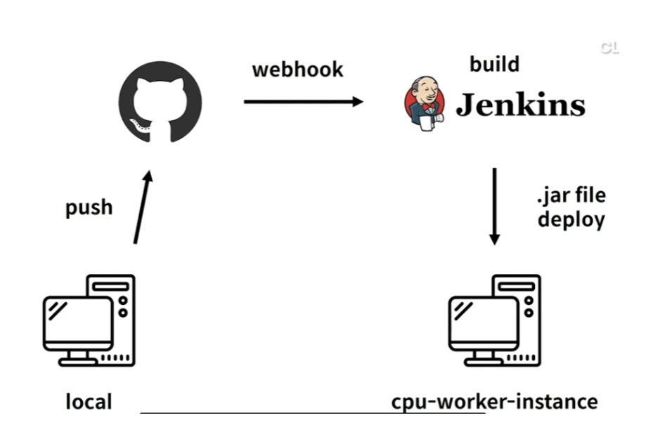

# CI-CD (Continuous Integration and Continuous Delivery Platform)

- <i>__CircleCI__ (`./circleci/config.yml`): CircleCI is a continuous integration and continuous delivery platform that helps software teams work smarter, faster. With CircleCI, every commit kicks off a new job in our platform, and code is built, tested, and deployed. 
- __Github Actions__ (`./.github/workflows/build-and-test.yml`) : GitHub Actions is a continuous integration and continuous delivery (CI/CD) platform that allows you to automate your build, test, and deployment pipeline. You can create workflows that build and test every pull request to your repository, or deploy merged pull requests to production.
- __Jenkins__ : Open source automation tool written in Java with plugins built for Continuous Integration purpose. It is used to build and test your software projects continuously
    - Jenkins-Build & automation deployment using `Github Webhooks` : Webhooks enable your GitHub App to receive real-time notifications when events happen on GitHub, such as when someone pushes a commit or opens a pull request in a repository
    
    
    
    - docker run -p 8080:8080 -p 50000:50000 -v jenkins_home:/var/jenkins_home jenkins/jenkins:lts-jdk11
    - docker-compose.yml :
    ```bash
      jenkins:
        image: jenkins/jenkins:lts
        privileged: true
        user: root
        ports:
          - 8089:8080
          - 50000:50000
        container_name: jenkins
        networks:
          - bridge
        volumes:
          - ~/jenkins:/var/jenkins_home
          - /var/run/docker.sock:/var/run/docker.sock
          - /usr/local/bin/docker:/usr/local/bin/docker
    ```