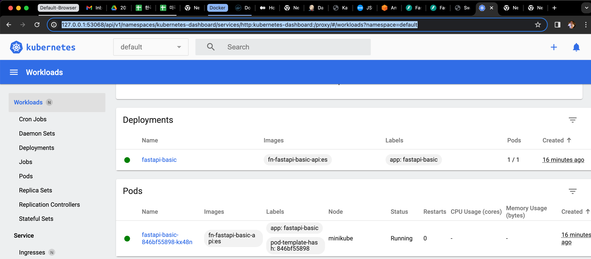

# Kubernetes

- <i>__Minikube__ : `minikube` is local Kubernetes, focusing on making it easy to learn and develop for Kubernetes. All you need is Docker (or similarly compatible) container or a Virtual Machine environment, and Kubernetes is a single command away: `minikube start` (<i>https://minikube.sigs.k8s.io/docs/start/</i>)

    - __Pods__ are the smallest deployable units of computing that you can create and manage in Kubernetes.
    - __A ReplicaSet__ is a higher-level object in Kubernetes that ensures a specified number of replicas of pods are running at all times. 

    - __To install the latest minikube stable release on x86-64 macOS using binary download__:
    ```bash
    curl -LO https://storage.googleapis.com/minikube/releases/latest/minikube-darwin-amd64
    sudo install minikube-darwin-amd64 /usr/local/bin/minikube
    
    brew install minikube
    minikube version
    ```
    - Start your cluster
    ```bash
    
    ➜  ~ minikube profile list
    |----------|-----------|---------|--------------|------|---------|---------|-------|--------|
    | Profile  | VM Driver | Runtime |      IP      | Port | Version | Status  | Nodes | Active |
    |----------|-----------|---------|--------------|------|---------|---------|-------|--------|
    | minikube | docker    | docker  | 192.168.49.2 | 8443 | v1.27.3 | Running |     1 | *      |
    |----------|-----------|---------|--------------|------|---------|---------|-------|--------|
        
    minikube start
    
    Or (Windows Version)
    $ minikube start --cpus=2 --memory=4g --disk-size=100g --driver=docker --kubernetes-version=v1.28
    Microsoft Windows 10 Pro 10.0.19045.3693 Build 19045.3693 의 minikube v1.32.0
    ..
    X Exiting due to PROVIDER_DOCKER_VERSION_EXIT_1: "docker version --format <no value>-<no value>:<no value>" exit status 1: request returned Internal Server 
    Error for API route and version http://%2F%2F.%2Fpipe%2Fdocker_engine/v1.24/version, check if the server supports the requested API version
    
    ~ docker context ls
    NAME                TYPE                DESCRIPTION                               DOCKER ENDPOINT                                        KUBERNETES     
    ENDPOINT   ORCHESTRATOR
    default *           moby                Current DOCKER_HOST based configuration   tcp://127.0.0.1:58291
    desktop-linux       moby                Docker Desktop                            unix:///Users/euiyoung.hwang/.docker/run/docker.sock
    
    $ docker context use desktop-linux
    desktop-linux
    Current context is now "desktop-linux"
    
    $ minikube status
    minikube
    type: Control Plane
    host: Running
    kubelet: Running
    apiserver: Running
    kubeconfig: Configured
    ```
    - __Interact with your cluster__
    ```bash
    If you already have kubectl installed (see documentation), you can now use it to access your shiny new cluster:
    kubectl get po -A
    
    Alternatively, minikube can download the appropriate version of kubectl and you should be able to use it like this: 
    minikube kubectl -- get po -A
    
    You can also make your life easier by adding the following to your shell config: (for more details see: kubectl)
    alias kubectl="minikube kubectl --"
    ```
    - __Deploy applications : Create a sample deployment and expose it on port 8080__
    ```bash 
    kubectl create deployment hello-minikube --image=kicbase/echo-server:1.0
    kubectl expose deployment hello-minikube --type=NodePort --port=8080
    
    It may take a moment, but your deployment will soon show up when you run:
    kubectl get services hello-minikube
    
    The easiest way to access this service is to let minikube launch a web browser for you:
    minikube service hello-minikube
    
    Alternatively, use kubectl to forward the port:
    kubectl port-forward service/hello-minikube 7080:8080
    
    Tada! Your application is now available at http://localhost:7080/.
    ```
    
     - __Install local docker to minikube__:
    ```bash
    
    # repository does not exist or may require docker login: denied
    (.venv) ➜  python-fastapi-basic git:(master) eval $(minikube docker-env)
    Host added: /Users/euiyoung.hwang/.ssh/known_hosts ([127.0.0.1]:52981)
    
    (.venv) ➜  python-fastapi-basic git:(master) kubectl get nodes 
    NAME       STATUS   ROLES           AGE    VERSION
    minikube   Ready    control-plane   206d   v1.27.3
    
    (.venv) ➜  python-fastapi-basic git:(master) docker build -t fn-fastapi-basic-api:es .
    
    (.venv) ➜  python-fastapi-basic git:(master) docker images                            
    REPOSITORY                                TAG       IMAGE ID       CREATED         SIZE
    fn-fastapi-basic-api                      es        5436923ba41f   3 seconds ago   1.04GB
    euiyoung/fn-flask-api                     es        4636df9868ab   6 months ago    1.08GB
    
    (.venv) ➜  python-fastapi-basic git:(master) kubectl create deployment fastapi-basic --image=fn-fastapi-basic-api:es
    error: failed to create deployment: deployments.apps "fastapi-basic" already exists
    
    (.venv) ➜  python-fastapi-basic git:(master) kubectl get pods
    NAME                             READY   STATUS    RESTARTS   AGE
    fastapi-basic-846bf55898-kx48n   1/1     Running   0          7m23s
    
    ➜  python-platform-engine git:(master) kubectl get svc 
    NAME            TYPE        CLUSTER-IP     EXTERNAL-IP   PORT(S)          AGE
    fastapi-basic   NodePort    10.108.79.85   <none>        7777:30663/TCP   3d20h
    kubernetes      ClusterIP   10.96.0.1      <none>        443/TCP          209d
    test            ClusterIP   10.98.250.16   <none>        8081/TCP         209d
    
    (.venv) ➜  python-fastapi-basic git:(master) kubectl expose deployment fastapi-basic --type=NodePort --port=27777
    (.venv) ➜  python-fastapi-basic git:(master) kubectl expose deployment fastapi-basic --type=LoadBalancer --port=27777
    
    (.venv) ➜  python-fastapi-basic git:(master) kubectl port-forward fastapi-basic-846bf55898-kx48n 27777:7777                 
    Forwarding from 127.0.0.1:27777 -> 7777
    Forwarding from [::1]:27777 -> 7777
    Handling connection for 27777
    Handling connection for 27777
    
    (.venv) ➜  python-fastapi-basic git:(master) minikube service list                                
    |----------------------|---------------------------|--------------|-----|
    |      NAMESPACE       |           NAME            | TARGET PORT  | URL |
    |----------------------|---------------------------|--------------|-----|
    | default              | fastapi-basic             |         7777 |     |
    | default              | kubernetes                | No node port |     |
    | default              | test                      | No node port |     |
    | kube-system          | kube-dns                  | No node port |     |
    | kubernetes-dashboard | dashboard-metrics-scraper | No node port |     |
    | kubernetes-dashboard | kubernetes-dashboard      | No node port |     |
    |----------------------|---------------------------|--------------|-----|
    
    (.venv) ➜  python-fastapi-basic git:(master) minikube service fastapi-basic --url
    http://127.0.0.1:56552
    ❗  Because you are using a Docker driver on darwin, the terminal needs to be open to run it.
    
     Kubernetes git:(master) minikube service fastapi-basic
    |-----------|---------------|-------------|---------------------------|
    | NAMESPACE |     NAME      | TARGET PORT |            URL            |
    |-----------|---------------|-------------|---------------------------|
    | default   | fastapi-basic |        7777 | http://192.168.49.2:30663 |
    |-----------|---------------|-------------|---------------------------|
    🏃  Starting tunnel for service fastapi-basic.
    |-----------|---------------|-------------|------------------------|
    | NAMESPACE |     NAME      | TARGET PORT |          URL           |
    |-----------|---------------|-------------|------------------------|
    | default   | fastapi-basic |             | http://127.0.0.1:59558 |
    |-----------|---------------|-------------|------------------------|
    🎉  Opening service default/fastapi-basic in default browser...
    ❗  Because you are using a Docker driver on darwin, the terminal needs to be open to run it.
    
    ➜  Kubernetes git:(master) ✗ kubectl apply -f ./nginx-deployment.yaml
    pod/nginx created
    service/nginx created
    
    ➜  Kubernetes git:(master) ✗ kubectl apply -f ./fastapi-basic-deployment.yaml
    pod/fastapi-basic created
    
    kubectl delete pod/nginx

    ```
    
    - __To install elasticsearch as omni-es into minikube cluster__:
    ```bash    
    ➜  ~ eval $(minikube docker-env)
    Host added: /Users/euiyoung.hwang/.ssh/known_hosts ([127.0.0.1]:49666)
    
    # rebuild Dockerfile into minikube
    python-CICD-fastapi-basic git:(master) ./docker-build.sh
    [+] Building 23.2s (13/13) FINISHED                                                                                                          docker:default
    => [internal] load build definition from Dockerfile                                                                                                   0.0s
    => => transferring dockerfile: 1.75kB                                                                                                                 0.0s
    ..
    
    ➜  python-CICD-fastapi-basic git:(master) docker images
    REPOSITORY                                TAG       IMAGE ID       CREATED              SIZE
    fn-cicd-basic-api                         omni_es   5e2bff0e1f34   15 seconds ago       779MB
    fn-cicd-basic-api                         es        3a46beaba0bb   About a minute ago   1.07GB
    fn-fastapi-basic-api                      es        5436923ba41f   5 days ago           1.04GB
    nginx                                     alpine    be5e6f23a990   3 weeks ago          43.6MB
    
    ➜  Kubernetes git:(master) ✗ kubectl apply -f omni-es-deployment.yaml
    pod/fn-cicd-basic-api-elasticsearch unchanged
    service/fn-cicd-basic-api-elasticsearch created
    
    ➜  Kubernetes git:(master) ✗ kubectl port-forward service/fn-cicd-basic-api-elasticsearch 9229:9201
    Forwarding from 127.0.0.1:9229 -> 9201
    Forwarding from [::1]:9229 -> 9201
    Handling connection for 9229
    Handling connection for 9229
    E0310 18:46:26.312494   62369 portforward.go:409] an error occurred forwarding 9229 -> 9201: error forwarding port 9201 to pod 33f052e2245965d80a4d9e8ca5cfa8680da11d914db8cb1638fe288ac048f542, uid : exit status 1: 2024/03/10 23:46:26 socat[130339] E connect(5, AF=2 127.0.0.1:9201, 16): Connection refused
    error: lost connection to pod

    ➜  Kubernetes git:(master) ✗ kubectl delete pod/fn-cicd-basic-api-elasticsearch
    pod "fn-cicd-basic-api-elasticsearch" deleted
    ```


- __Minikube dashboard (<i>http://127.0.0.1:53068/api/v1/namespaces/kubernetes-dashboard/services/http:kubernetes-dashboard:/proxy/#/workloads?namespace=default</i>): Access the Kubernetes dashboard running within the minikube cluster__

    

