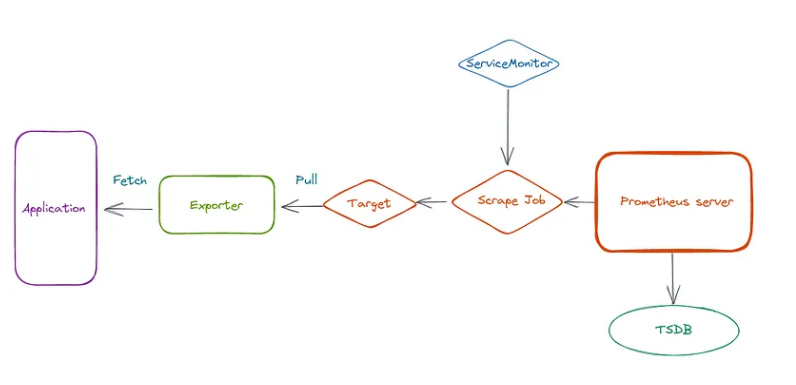

<i>Prometheus has many ready-to-use exporters, but sometimes you may need to collect your own metrics.

For this, Prometheus provides client libraries that we can use to generate metrics with the necessary labels.

Such an exporter can be included directly in the code of your application, or it can be run as a separate service that will poll one of your services and receive data from it, which will then be converted into the Prometheus format and sent to the Prometheus server.

- Using Python Virtual Environment
```bash
python -m venv .venv
source .venv/bin/activate

Or

➜  python-platform-engine git:(master) ✗ source ./Monitoring/create_virtual_env.sh
VirtualEnv exists.
Created virtual enviroment >> + /Users/euiyoung.hwang/ES/Python_Workspace/python-platform-engine/Monitoring/.venv/bin/activate
Install requirements.txt
Requirement already satisfied: pip in ./Monitoring/.venv/lib/python3.9/site-packages (21.2.3)
Collecting pip
  Using cached pip-23.3.2-py3-none-any.whl (2.1 MB)
Installing collected packages: pip
  Attempting uninstall: pip
    Found existing installation: pip 21.2.3
    Uninstalling pip-21.2.3:
      Successfully uninstalled pip-21.2.3
Successfully installed pip-23.3.2
Collecting prometheus-client==0.19.0 (from -r /Users/euiyoung.hwang/ES/Python_Workspace/python-platform-engine/Monitoring/requirements.txt (line 1))
  Using cached prometheus_client-0.19.0-py3-none-any.whl.metadata (1.8 kB)
Using cached prometheus_client-0.19.0-py3-none-any.whl (54 kB)
Installing collected packages: prometheus-client
Successfully installed prometheus-client-0.19.0
Install Completely..
```

- Install the dependency
```bash

# https://itnext.io/prometheus-building-a-custom-prometheus-exporter-in-python-988908327600
$ pip install prometheus_client
```

- Prometheus Metrics
The general scheme of the Prometheus server and its exporters in Kubernetes looks like this:



- Test application using prometheus client
```bash
  ~ curl -I GET localhost:8080/q
HTTP/1.1 200 OK
x-correlation-id: aaaaaaaa
date: Fri, 02 Feb 2024 04:27:12 GMT
transfer-encoding: chunked

HTTP/1.0 501 Unsupported method ('HEAD')
Server: BaseHTTP/0.6 Python/3.9.7
Date: Fri, 02 Feb 2024 04:27:12 GMT
Connection: close
Content-Type: text/html;charset=utf-8
Content-Length: 497

  ~ curl http://localhost:9000
# HELP python_gc_objects_collected_total Objects collected during gc
# TYPE python_gc_objects_collected_total counter
python_gc_objects_collected_total{generation="0"} 68.0
python_gc_objects_collected_total{generation="1"} 301.0
python_gc_objects_collected_total{generation="2"} 0.0
# HELP python_gc_objects_uncollectable_total Uncollectable objects found during GC
# TYPE python_gc_objects_uncollectable_total counter
python_gc_objects_uncollectable_total{generation="0"} 0.0
python_gc_objects_uncollectable_total{generation="1"} 0.0
python_gc_objects_uncollectable_total{generation="2"} 0.0
# HELP python_gc_collections_total Number of times this generation was collected
# TYPE python_gc_collections_total counter
python_gc_collections_total{generation="0"} 39.0
python_gc_collections_total{generation="1"} 3.0
python_gc_collections_total{generation="2"} 0.0
# HELP python_info Python platform information
# TYPE python_info gauge
python_info{implementation="CPython",major="3",minor="9",patchlevel="7",version="3.9.7"} 1.0
# HELP http_requests_total HTTP request
# TYPE http_requests_total counter
http_requests_total{instance="hwang-uiyeongs-MacBook-Pro.local",status_code="200"} 2.0
# HELP http_requests_created HTTP request
# TYPE http_requests_created gauge
http_requests_created{instance="hwang-uiyeongs-MacBook-Pro.local",status_code="200"} 1.706847989438399e+09
➜  ~
```