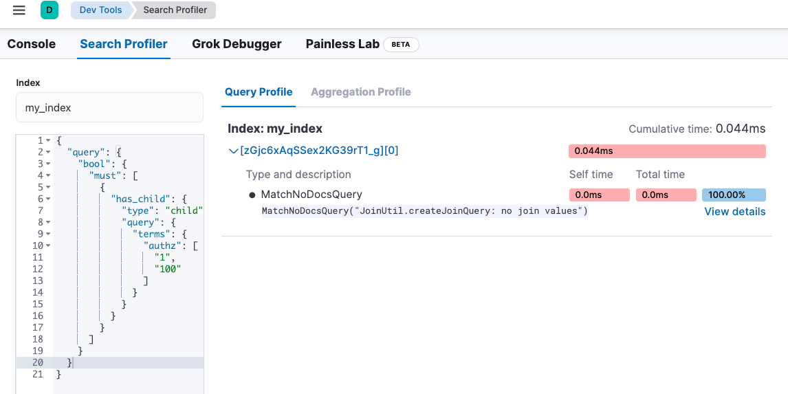

### Create Shell script for running/stopping the instance of Elasticsearch
```bash 
$ echo 'bin/elasticsearch -d -p es.pid' > start.sh
$ echo 'kill `cat es.pid`' > stop.sh
$ chmod 755 start.sh stop.sh
```

### The option for running the instance of Elasticsearch
```bash 
$ bin/elasticsearch -E cluster.name=my-cluster -E node.name="node-1"
```

### CRUD in Elasticsearch
```bash 
#--- index, create, update, delete

POST _bulk
{"index":{"_index":"test", "_id":"1"}}
{"field":"value one"}
{"index":{"_index":"test", "_id":"2"}}
{"field":"value two"}
{"delete":{"_index":"test", "_id":"2"}}
{"create":{"_index":"test", "_id":"3"}}
{"field":"value three"}
{"update":{"_index":"test", "_id":"1"}}
{"doc":{"field":"value two"}}

# Bulk json using file
$ curl -XPOST "http://localhost:9200/_bulk" -H 'Content-Type: application/json' --data-binary @bulk.json


POST _bulk
{ "index": { "_index": "my-index-b", "_id" : "1"} }
{ "field1": "value1" }

POST _bulk
{ "update": { "_index": "my-index-b", "_id": "1" } }
{ "doc": { "field1": "value1" }, "doc_as_upsert": true }
#--- upsert, doc_as_upsert, script, params

POST my-index-b/_search
{
  "query": {
    "match_all": {}
  }
}

#--
DELETE logs-debug
PUT logs-debug
{
  "mappings": {
    "properties": {
      "@timestamp": {
        "type": "date"
      },
      "message": {
        "type": "text"
      },
      "level": {
        "type": "constant_keyword",
        "value": "debug"
      }
    }
  }
}

POST logs-debug/_doc
{
  "date": "2019-12-12",
  "message": "Starting up Elasticsearch",
  "type": "log",
  "level": "debug"
}

POST logs-debug/_doc
{
  "date": "2019-12-12",
  "type": "log1",
  "message": "Starting up Elasticsearch"
}

POST logs-debug/_search
{
  "query": {
    "match_all": {}
  }
}

POST logs-debug/_update_by_query
{
  "script": {
    "source": "ctx._source['update'] = 'test'"
  },
  "query": {
    "term": {
      "type.keyword": "log1"
    }
  }
}
```


### Join in Elasticsearch
```bash 

DELETE my_index

PUT my_index
{
  "mappings": {
      "properties": {
        "acl_join_field": { 
          "type": "join",
          "relations": {
            "parent": "child" 
          }
        }
    }
  }
}


# parent index
PUT _bulk
{"index":{"_index":"my_index","_id":"1"}}
{"text":"This is a question","acl_join_field":{"name":"parent"}}


# child index
PUT _bulk?routing=1&refresh
{"index":{"_index":"my_index","_id":"3"}}
{"text":"This is a child","authz":["1","2"], "acl_join_field":{"name":"child","parent":"1"}}


GET my_index
GET my_index/_search

GET _cat/indices

GET my_index/_search
{
  "query": {
    "bool": {
      "must": [
        {
          "has_child": {
            "type": "child",
            "query": {
              "terms": {
                "authz": [
                  "1",
                  "100"
                ]
              }
            }
          }
        }
      ]
    }
  }
}
```


### reindex in Elasticsearch
- The new cluster doesn’t have to start fully-scaled out. As you migrate indices and shift the load to the new cluster, you can add nodes to the new cluster and remove nodes from the old one.
- Create an index with the appropriate mappings and settings. Set the refresh_interval to -1 and set number_of_replicas to 0 for faster reindexing.

```bash 
# - reindex.remote.whitelist="192.168.68.1:*,host.docker.internal:*,localhost:*"

POST _reindex?wait_for_completion=false
{
  "conflicts": "proceed",
  "source": {
    "index": "test_set",
    "query": {
      "bool": {
        "must_not": [
          {
            "exists": {
              "field": "query"
            }
          }
        ]
      }
    }
  },
  "dest": {
    "index": "test-000001",
    "op_type": "create"
  }
}

POST _reindex?wait_for_completion=true
{
  "source": {
    "remote": {
      "host": "http://host.docker.internal:9209",
      "username": "elastic",
      "password": "your_password"
    },
    "index": "performance_metrics",
    "query": {
     "match_all": {}
    }
  },
  "dest": {
    "index": "cp99_performance_metrics"
  }
}

GET _cat/indices

GET _tasks?detailed=true&actions=*reindex

GET _tasks/BH_UUNP2RjafE0aNHGi_Hw:216731707
```


### ILM in Elasticsearch
- You can configure index lifecycle management (ILM) policies to automatically manage indices according to your performance, resiliency, and retention requirements
- Spin up a new index when an index reaches a certain size or number of documents
- Create a new index each day, week, or month and archive previous ones
- Delete stale indices to enforce data retention standards

```bash 
# test
PUT /_ilm/policy/omnisearch_highlight_policy
{
  "policy": {
    "phases": {
      "hot": {
        "actions": {
          "rollover": {
            "max_size": "5GB",
            "max_docs": 2,
            "max_age": "15d"
          }
        }
      },
      "cold": {
        "min_age": "0m",
        "actions": {}
      },
      "delete": {
        "min_age": "5m",
        "actions": {
          "delete": {
            "delete_searchable_snapshot": true
          }
        }
      }
    }
  }
}


# need to update the alias
PUT _index_template/rolling
{
  "index_patterns": [
    "omnisearch_highlight_v*"
  ],
  "template": {
    "settings": {
      "number_of_shards": 1,
      "number_of_replicas": 0,
      "index.lifecycle.name": "omnisearch_highlight_policy",
      "index.lifecycle.rollover_alias": "rolling-write-index",
      "analysis": {
        "analyzer": {
          "test_analyzer": {
            "filter": [
              "lowercase",
              "stop",
              "snowball"
            ],
            "char_filter": [
              "test_char_filter"
            ],
            "tokenizer": "whitespace"
          }
        },
        "char_filter": {
          "test_char_filter": {
            "type": "mapping",
            "mappings": [
              "+ => _plus_",
              "- => _minus_"
            ]
          }
        }
      }
    },
    "mappings": {
      "properties": {
        "my_keyword_field": {
          "type": "keyword"
        }
      }
    }
  }
}


# different index
PUT _bulk
{"index":{"_index":"test_set"}}
{"my_keyword_field": "man"}


GET omnisearch_highlight_v2-000001
GET omnisearch_highlight_v2-000001/_ilm/explain


GET omnisearch_highlight_v2-*/_search
{
  "track_total_hits": true, 
  "query": {
    "match_all": {}
  },
  "size": 200
}

GET _cat/aliases


# ilm alias
POST _aliases
{
  "actions": [
    {
      "add": {
        "index": "omnisearch_highlight_v2-000001",
        "alias": "rolling-write-index"
      }
    }
  ]
}


PUT _bulk
{"index":{"_index":"rolling-write-index"}}
{"my_keyword_field": "man"}


GET omnisearch_highlight_v2-000002
GET omnisearch_highlight_v2-000002/_ilm/explain

GET omnisearch_highlight_v2-000003

GET _cat/indices?v

GET myindex-create-from-curator2/_settings
GET myindex-create-from-curator2/_mapping

```


### snapshot in Elasticsearch
```bash 

# register snapshot
PUT /_snapshot/my_backup
{
  "type": "fs",
  "settings": {
    "compress": true,
    "location": "/usr/share/elasticsearch/backup"
  }
}

GET /_snapshot/my_backup


# take a snapshot
PUT /_snapshot/my_backup/backup_20240209?wait_for_completion=true
{
  "indices": "test_index1",
  "ignore_unavailable": true,
  "include_global_state": true
}

DELETE _snapshot/my_backup/test_index-20240210

GET /_snapshot/my_backup/backup_20240209
GET /_snapshot/my_backup/backup_20240209/_status

POST _snapshot/my_backup/backup_20240209/_restore
{
  "indices": "test_index1",
   "ignore_unavailable": true,
  "include_global_state": false,              
  "rename_pattern": "(.+)",
  "rename_replacement": "$1_restored",
  "include_aliases": false
}
```


### Search in Elasticsearch
```bash 

# --
POST my_index/_bulk
{"index":{"_id":1}}
{"message":"The quick brown fox"}
{"index":{"_id":2}}
{"message":"The quick brown fox jumps over the lazy dog"}
{"index":{"_id":3}}
{"message":"The quick brown fox jumps over the quick dog"}
{"index":{"_id":4}}
{"message":"Brown fox brown dog"}
{"index":{"_id":5}}
{"message":"Lazy jumping dog"}


GET my_index/_search
{
  "query": {
    "match": {
      "message": {
        "query": "quick dog",
        "operator": "and"
      }
    }
  },
  "highlight": {
    "require_field_match": true,
    "order": "score",
    "pre_tags": [
      "<b>"
    ],
    "post_tags": [
      "</b>"
    ],
    "fields": {
      "*": {
        "number_of_fragments": 1,
        "type": "plain",
        "fragment_size": 150
      }
    }
  }
}


GET my_index/_search
{
  "query": {
    "match_phrase": {
      "message": {
        "query": "lazy dog",
        "slop": 1
      }
    }
  }
}

```

### Search-Profiler on Dev Console in Kibana



### Analyze
```bash 
#--
GET _analyze
{
  "text": "The quick brown fox jumps over the lazy dog",
  "tokenizer": "whitespace",
  "filter": [
    "lowercase",
    "stop",
    "snowball"
  ]
}

# same result with lowercase, stop token filter
GET _analyze
{
  "text": "The quick brown fox jumps over the lazy dog",
  "analyzer": "snowball"
}

GET my_index2

PUT my_index2
{
  "mappings": {
    "properties": {
      "message": {
        "type": "text",
        "analyzer": "snowball"
      }
    }
  }
}

PUT my_index2/_doc/1
{
  "message": "The quick brown fox jumps over the lazy dog"
}


GET my_index2/_search
{
  "query": {
    "match": {
      "message": "jumping"
    }
  }
}

# Cheeck termvectors
GET my_index2/_termvectors/1?fields=message


DELETE my_index3

PUT my_index3
{
  "settings": {
    "index": {
      "analysis": {
        "analyzer": {
          "my_custom_analyzer": {
            "type": "custom",
            "tokenizer": "whitespace",
            "filter": [
              "lowercase",
              "my_stop_filter",
              "snowball"
            ]
          }
        },
        "filter": {
          "my_stop_filter": {
            "type": "stop",
            "stopwords": [
              "brown"
            ]
          }
        }
      }
    }
  }
}

GET my_index3/_analyze
{
  "analyzer": "my_custom_analyzer",
  "text": [
    "The quick brown fox jumps over the lazy dog"
  ]
}
```